# Modern ETL Automation on Azure with Terraform and GitHub Actions

[](https://www.python.org/) [](https://www.terraform.io/) [](https://azure.microsoft.com/)

## Project Overview
This repository contains my capstone project for learning and demonstrating modern data engineering and cloud automation skills. The goal was to design and implement a complete ETL (Extract, Transform, Load) pipeline for sales analytics, using real-world tools and best practices. Throughout this project, I focused on building a solution that is not only functional, but also maintainable, scalable, and secure—mirroring the standards of professional data teams. By integrating Python, Azure Data Factory, Terraform, and GitHub Actions, I gained hands-on experience with technologies that are widely used in the industry, and I am excited to showcase my ability to deliver end-to-end data solutions.

## Executive Summary
- **Automated ETL Pipeline:** End-to-end automation from data ingestion to cloud deployment.
- **Cloud-Native Architecture:** Built on Azure services, ensuring scalability, reliability, and security.
- **Infrastructure as Code:** All resources are provisioned and managed via Terraform for reproducibility and compliance.
- **CI/CD Integration:** GitHub Actions orchestrate continuous integration and deployment, ensuring rapid, error-free delivery.
- **Best Practices:** Adheres to modern standards in DevOps, data governance, and software engineering.

## Key Project Highlights
- **High automation:** Most steps are automated; some actions may still be manual.
- **Enterprise security:** Secrets are managed securely (Azure Key Vault for Kaggle credentials; GitHub Secrets for CI/CD); nothing is hardcoded.
- **Extensibility:** Modular design enables rapid adaptation to new data sources, business rules, or cloud environments.
- **Operational visibility:** All processes are version-controlled, logged, and easily monitored.

## Core Competencies & Technologies
- **Python:** Advanced scripting, data wrangling (Pandas), API integration.
- **Azure Data Factory:** Visual orchestration, data flows, and pipeline automation.
- **Terraform:** Infrastructure provisioning, compliance, and lifecycle management.
- **GitHub Actions:** CI/CD automation, workflow orchestration, and secure secret management (via GitHub Secrets; Key Vault used for data-source credentials).
- **Azure Blob Storage:** Scalable, durable cloud storage for raw and processed data.
- **Kaggle API:** Automated data acquisition from external sources.
- **DevOps & Cloud Engineering:** End-to-end automation, monitoring, and best practices.
- **Azure Key Vault:** Secure, centralized secrets management for credentials and sensitive configuration.

## Project Structure
```
├── adf/                  # Azure Data Factory artifacts
├── data/                 # Local data (raw and processed)
├── docs/                 # Documentation and images
├── src/                  # Python scripts for extraction and transformation
├── terraform/            # Infrastructure as code
├── .github/workflows/    # GitHub Actions workflows
├── requirements.txt      # Python dependencies
├── README.md             # Main documentation
```

## ETL Flow Overview

```mermaid
flowchart LR
    subgraph ETL_Flow ["🔄 ETL Pipeline"]
        A([📥 Extract: Kaggle Data])
        B([📁 Raw Data: Blob Storage])
        C([⚙️ Transform: Data Factory])
        D([📊 Processed: Blob Storage])
        A --> B
        B --> C
        C --> D
    end
    
    subgraph Infrastructure ["🏗️ Infrastructure"]
        E([🏗️ Terraform: IaC])
        F([🚀 GitHub Actions: CI/CD])
    end
    
    subgraph Security ["🔐 Security"]
        G([🔑 Key Vault: API Keys])
    end
    
    %% Connections
    G -.-> A
    E -.-> B
    E -.-> C
    E -.-> G
    F -.-> B
    
    %% Styling
    classDef etlBox fill:#e8f5e8,stroke:#388e3c,stroke-width:2px
    classDef infraBox fill:#e3f2fd,stroke:#1976d2,stroke-width:2px
    classDef secBox fill:#fff3e0,stroke:#f57c00,stroke-width:2px
    
    class ETL_Flow etlBox
    class Infrastructure infraBox
    class Security secBox
    
    %% Link styling
    linkStyle 0 stroke:#2196f3,stroke-width:3px
    linkStyle 1 stroke:#2196f3,stroke-width:3px
    linkStyle 2 stroke:#2196f3,stroke-width:3px
    linkStyle 3 stroke:#9c27b0,stroke-width:2px
    linkStyle 4 stroke:#9c27b0,stroke-width:2px
    linkStyle 5 stroke:#9c27b0,stroke-width:2px
    linkStyle 6 stroke:#9c27b0,stroke-width:2px
    linkStyle 7 stroke:#9c27b0,stroke-width:2px
```


## Solution Architecture & Process
### 1. Data Extraction
- **Source:** Kaggle public dataset (`rohitsahoo/sales-forecasting`).
- **Automation:** Python script authenticates and downloads the latest data securely.

### 2. Data Transformation & Cleaning
- **Process:** Data is cleaned, normalized, and validated using Pandas, ensuring high data quality and consistency.

### 3. Data Storage
- **Cloud Storage:** Both raw and processed datasets are stored in Azure Blob Storage, enabling secure, scalable access for downstream analytics.

### 4. Orchestration & Advanced Transformation
- **ADF Pipelines & Data Flows:** Azure Data Factory orchestrates the ETL process, applying business logic, aggregations, and data enrichment.

### 5. Infrastructure as Code
- **Terraform:** All Azure resources, including Key Vault, are defined as code, supporting rapid deployment, versioning, and compliance.

### 6. CI/CD & Automation
- **GitHub Actions:** Automates data uploads, infrastructure changes, and workflow management. Secrets are managed securely via GitHub Secrets and Azure Key Vault.

## CI/CD Automation with GitHub Actions
- **Workflow:** `.github/workflows/upload-to-blob.yml`
- **Triggers:** On push to `data/processed/sales_clean.csv` or manual dispatch.
- **Steps:** Checkout, setup, authenticate, upload to Azure Blob Storage.
- **Secrets:** Managed securely via GitHub Secrets and Azure Key Vault.

## Secure Secrets Management with Azure Key Vault
This project integrates **Azure Key Vault** to ensure the highest standards of security for sensitive information such as credentials, API keys, and connection strings. Key Vault is provisioned and managed via Terraform, and access policies are strictly defined to allow only authorized identities to retrieve or manage secrets.

### Key Features
- **Centralized Secret Storage:** Sensitive credentials are centrally managed (e.g., Kaggle credentials in Azure Key Vault; CI/CD secrets via GitHub Secrets). Nothing is hardcoded or committed.
- **Access Control:** Fine-grained access policies restrict secret access to only required users and services (e.g., Data Factory, automation identities).
- **Automation Ready:** Key Vault is provisioned automatically as part of the infrastructure-as-code deployment, ensuring consistency across environments.
- **Integration with Azure Data Factory:**ADF integration (planned):** The architecture is prepared for ADF linked services to retrieve secrets from Azure Key Vault; in the current version, linked services use credentials configured directly in ADF.
- **Compliance & Auditability:** All secret access is logged and auditable, supporting compliance with enterprise and regulatory standards.

### Example: Terraform Resource
```hcl
resource "azurerm_key_vault" "kv" {
  name                        = "kv-etl-automation"
  location                    = azurerm_resource_group.rg.location
  resource_group_name         = azurerm_resource_group.rg.name
  tenant_id                   = var.tenant_id
  sku_name                    = "standard"
  purge_protection_enabled    = false

  access_policy {
    tenant_id = var.tenant_id
    object_id = var.object_id
    secret_permissions = ["Get", "Set", "List", "Delete"]
  }
}
```

### Best Practices Followed
- No secrets are stored in code or configuration files.
- All automation (Terraform, CI/CD) uses secure identity and access management.
- Key Vault is integrated with other Azure services for seamless, secure secret retrieval.

## Secure Kaggle Credential Management with Azure Key Vault

Azure Key Vault securely stores the entire `kaggle.json` file (username and API key) as a single secret, ensuring credentials are never exposed in code or local files. This supports automation, compliance, and auditability.

**Store credentials:**
```bash
az keyvault secret set --vault-name kv-etl-automation --name kaggle-json --value '{"username":"lexvidal","key":"YOUR_KAGGLE_API_KEY"}'
```

**Retrieve for automation:**
```bash
az keyvault secret show --vault-name kv-etl-automation --name kaggle-json --query value -o tsv > kaggle.json
```

**Best practices:**
- Never commit credentials to source control.
- Use RBAC and audit logs for access control.
- Integrate secret retrieval into all automated workflows.

This enterprise approach ensures that all sensitive credentials, including those for Kaggle, are managed securely, accessed only by authorized processes, and fully auditable for compliance.

## Azure Data Factory: Orchestration & Advanced Data Transformation
Azure Data Factory (ADF) is the core orchestration engine in this project, enabling scalable, visual, and code-free data integration across cloud and on-premises sources. ADF pipelines and data flows are used to automate and manage the entire ETL process, ensuring data quality, consistency, and business logic enforcement.

### Key Features & Implementation
- **Pipeline Orchestration:** ADF pipelines coordinate the movement and transformation of data from raw ingestion to processed analytics-ready outputs.
- **Mapping Data Flows:** Visual, scalable data transformation logic is implemented using Mapping Data Flows, allowing for complex operations such as filtering, type conversion, aggregation, and enrichment—all without manual coding.
- **Integration with Azure Key Vault:** **Key Vault integration (planned):** Linked services can be configured to retrieve credentials from Azure Key Vault; in this version, they are configured directly in ADF.
- **Parameterization:** Pipelines and data flows are parameterized for reusability and flexibility, supporting multiple environments and data sources.
- **Monitoring & Logging:** ADF provides built-in monitoring, logging, and alerting, enabling operational visibility and rapid troubleshooting.
- **Artifacts Structure:**
  - `adf/pipeline_sales_etl/pipeline_sales_etl.json`: Main pipeline definition for orchestrating the ETL process.
  - `adf/dataflow_sales_transformations/df_sales_transformations.json`: Data flow for advanced sales data transformation and aggregation.
  - `adf/datasets/`: Definitions for source and sink datasets.
  - `adf/linkedservices/`: Secure connections to Azure resources, including Key Vault integration.

### Example: Data Flow Logic
- **Filter:** Remove records with missing or invalid dates.
- **Type Conversion:** Ensure all columns have the correct data types for downstream analytics.
- **Aggregation:** Summarize sales by customer, region, or product as needed.
- **Enrichment:** Add calculated fields or business logic transformations.

### Best Practices Followed
- All pipelines and data flows are version-controlled and documented.
- Secrets and credentials should not be stored directly in ADF. In this version they are configured in ADF; migration to Key Vault is planned.
- Modular, reusable design for easy adaptation to new business requirements.

## Tools & Services Used
- Python, Pandas, Kaggle API
- Azure Blob Storage, Azure Data Factory, Azure Key Vault
- Terraform, GitHub Actions, Azure CLI, VS Code

## Example Use Case: Sales Analytics
- **Business Problem:** Automate the ingestion, cleaning, and transformation of sales data for analytics and reporting.
- **Solution:** Data is extracted, cleaned, uploaded, and processed for BI or ML.
- **Benefits:** Fully automated, reproducible, scalable, and auditable pipeline.

## Documentation & Visual Evidence
The `docs/images` directory contains a curated collection of professional screenshots from the Azure Portal. These images provide visual evidence of the deployed resources, pipeline executions, data flows, monitoring dashboards, and security configurations. They serve to validate the successful implementation and operation of the ETL solution, and can be referenced for technical presentations, documentation, or interviews.

## Contributing
Contributions are welcome! Open an issue or pull request for suggestions, improvements, or fixes.

## Author
**Alexandre Vidal**  
Email: alexvidaldepalol@gmail.com  
[LinkedIn](https://www.linkedin.com/in/alexandre-vidal-de-palol-a18538155/)  
[GitHub](https://github.com/alexvidi)

**Project Repository:** [Azure-Automation-Project](https://github.com/alexvidi/azure-etl-automation-project)

---
